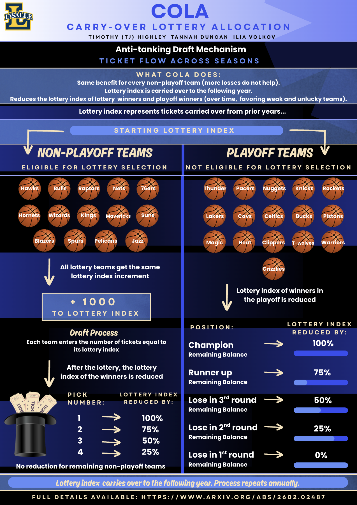

# Carry-Over Lottery Allocation Research

Code repository for the simulations and results used in the research paper **["Carry-Over Lottery Allocation: Practical Incentive-Compatible Drafts"](https://arxiv.org/html/2602.02487v1)**. The paper introduces **Carry-Over Lottery Allocation (COLA)**, an anti-tanking NBA draft mechanism.

## Overview

This repository contains the model implementation, historical data processing, simulation code, generated results, and figures used to study whether COLA can support competitive balance without rewarding teams for intentionally losing games.

## What I Did

- Implemented COLA lottery-index update rules in Python.
- Processed historical NBA draft and playoff data from 1985-2024.
- Built simulations to test long-run league outcomes under COLA.
- Generated result tables and visualizations for draft position, playoff streaks, non-playoff streaks, and lottery-index behavior.
- Compared whether the mechanism avoids persistent team disadvantage while reducing incentives to tank.

## Key Findings

- Non-playoff teams receive the same lottery-index increase, so additional losses after missing the playoffs do not improve draft odds.
- Lottery tickets carry over across seasons, helping teams that remain weak or unlucky.
- Successful teams and top-pick winners lose part or all of their lottery index.
- Long-run simulations suggest teams do not remain permanently trapped at the bottom or top of the league.

## Reference

Research Paper:

Highley, T., Duncan, T., & Volkov, I. (2026). **Carry-Over Lottery Allocation: Practical Incentive-Compatible Drafts**. arXiv:2602.02487v1.  
https://arxiv.org/html/2602.02487v1
